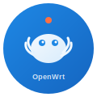
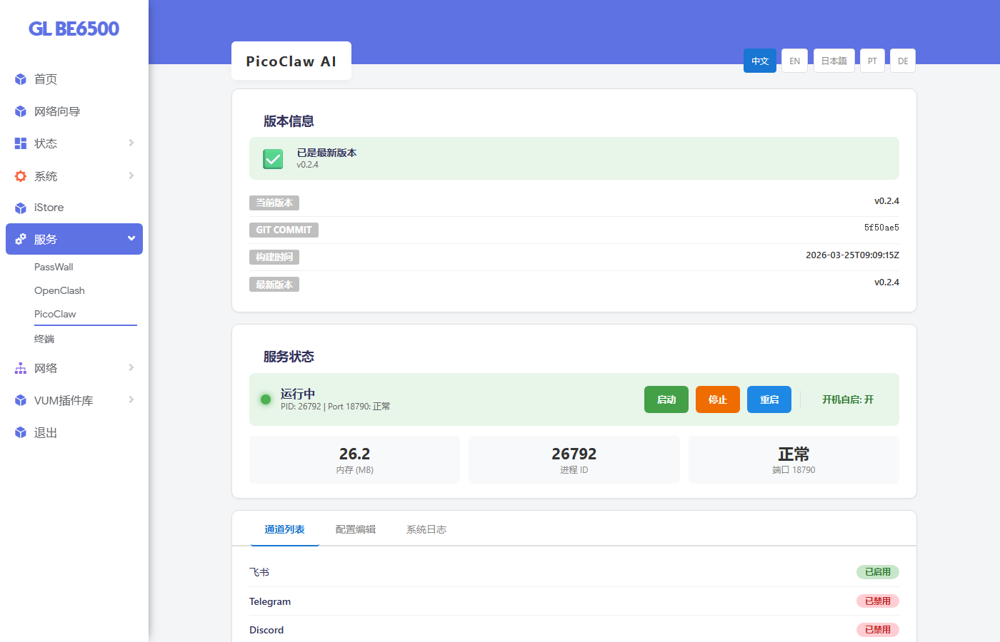
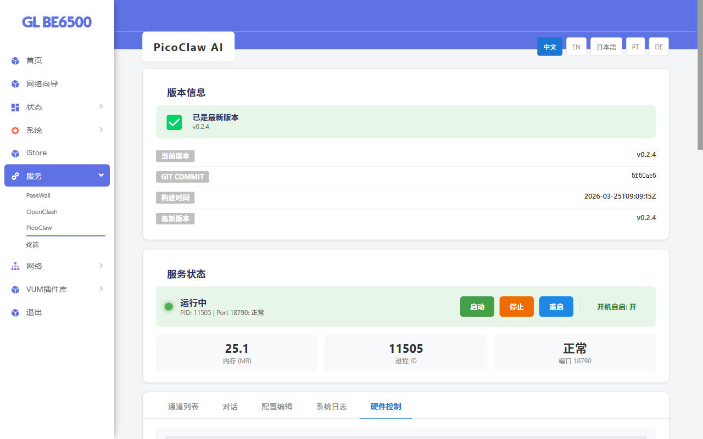
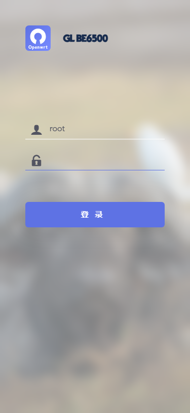

<p align="center">
  
</p>

<h1 align="center">luci-app-picoclaw</h1>

<p align="center">
  <b>ルーターをAIアシスタントに — ブラウザで<a href="https://github.com/sipeed/picoclaw">PicoClaw</a>を管理</b><br>
  <sub>サービス管理 · モデル設定 · ハードウェア制御</sub>
</p>

<p align="center">
  
  
  
</p>

<p align="center">
  <a href="README.md">English</a> ·
  <a href="README.zh.md">简体中文</a> ·
  日本語 ·
  <a href="README.de.md">Deutsch</a> ·
  <a href="README.pt.md">Português</a>
</p>

---

## これは何？

**[PicoClaw](https://github.com/sipeed/picoclaw)** は、ルーター上で動作するAIアシスタントです。大規模言語モデル（ChatGPT、DeepSeek、GLMなど）に接続し、Feishu、Telegram、Discord、WeChatなどでチャットできます。

しかし、PicoClaw自体にはグラフィカルインターフェースがなく、コマンドラインやJSON手動編集で設定する必要があります。

**このプロジェクトはPicoClawのWeb管理インターフェース**（LuCIプラグイン）を追加します。ブラウザだけで全ての操作が可能：サービスの起動/停止、AIモデルの切替、APIキーの設定、検索エンジンの管理など — コマンドライン不要。

> **LuCI** はOpenWrtルーターで使用されるWebインターフェースフレームワークです。ルーターの管理画面（例：192.168.1.1）を開くと、それがLuCIです。

## 📸 スクリーンショット

| ダッシュボード | 設定エディタ |
|:---:|:---:|
|  |  |

| ハードウェア制御 | モバイル表示 |
|:---:|:---:|
|  |  |

## ✨ 機能

- **サービス制御** — ワンクリックで起動 / 停止 / 再起動、自動起動設定、リアルタイムログ表示
- **チャンネル管理** — Feishu、Telegram、Discord、WeChatなどの接続ステータス確認
- **モデル設定** — AIモデルのビジュアルフォームエディタ、プロバイダープリセット付き（Zhipu、DeepSeek、Qwen、OpenAIなど）— APIキーを入力するだけ
- **検索エンジン設定** — AIがウェブ検索で回答可能。GLM Search、Baidu、DuckDuckGoなどに対応（中国国内可用性情報付き）
- **ハードウェア制御** — システム情報、USBデバイス、GPIO切替
- **スキル管理** — PicoClawスキルの表示、削除、インポート、3つの内蔵プリセット（診断、バックアップ、アプリインストーラ）
- **JSONエディタ** — 上級者向けの直接設定ファイル編集（検証付き）

## 📋 動作要件

| | 詳細 |
|---|---|
| **ルーターOS** | OpenWrt 21.02+ または iStoreOS（LuCIインターフェース付き） |
| **PicoClawバイナリ** | 先にインストール必須 — このプラグインはWeb UIのみ、PicoClaw自体ではありません |
| **アーキテクチャ** | 全アーキテクチャ対応（純粋Lua） |

## 🚀 インストール

### ステップ1: PicoClawのインストール

PicoClawはコアとなるAIアシスタントプログラムです — 先にインストールする必要があります。ルーターにSSH接続して実行：

```bash
cd /tmp
wget https://github.com/sipeed/picoclaw/releases/download/v0.2.7/picoclaw_Linux_x86_64.tar.gz
tar xzf picoclaw_Linux_x86_64.tar.gz
cp picoclaw /usr/bin/picoclaw && chmod +x /usr/bin/picoclaw
picoclaw --version   # バージョン番号が表示されればOK
```

> ⚠️ 上記リンクはx86_64用です。ルーターがARMの場合（Xiaomi、TP-Linkなど）、[PicoClaw Releases](https://github.com/sipeed/picoclaw/releases)から正しいバイナリをダウンロードしてください。

### ステップ2: LuCIインターフェースのインストール

**方法A: iStore**（推奨、最も簡単）

ルーターのiStoreを開く → `picoclaw` を検索 → インストール

**方法B: コマンドラインでIPKをインストール**

```bash
cd /tmp
wget https://github.com/GennKann/luci-app-picoclaw/releases/latest/download/luci-app-picoclaw_1.1.6-1_all.ipk
opkg install luci-app-picoclaw_1.1.6-1_all.ipk
rm -rf /tmp/luci-*   # LuCIキャッシュをクリア
```

インストール後、ブラウザでアクセス：`http://<ルーターIP>/cgi-bin/luci/admin/services/picoclaw`

## 🤖 モデル設定

PicoClawが動作するには、大規模言語モデルに接続する必要があります。PicoClawは「クライアント」であり、AI自体は含まれていません — 各AIサービスのAPIを呼び出します。**APIキー**（パスワードのようなもの）を提供して、PicoClawがサービスにアクセスできるようにします。

**設定方法：**

1. **設定エディタ**タブ → **モデルリスト**セクションを見つける
2. プロバイダープリセットボタン（例：「Zhipu GLM」「DeepSeek」）をクリック — APIベースURLが自動入力されます
3. **APIキー**を入力（プロバイダーのウェブサイトで登録して取得）
4. ドロップダウンから**デフォルトモデル**を選択
5. **保存**をクリック

**対応プロバイダー：** Zhipu · DeepSeek · Qwen · OpenAI · Anthropic · OpenRouter · Ollama

> 💡 **APIキーをお持ちでない方へ：** ほとんどのプロバイダーは無料クレジットを提供しています：
> - [Zhipu（智谱）](https://open.bigmodel.cn/) — 中国国内、登録時無料クレジット
> - [DeepSeek](https://platform.deepseek.com/) — 中国国内、登録時無料クレジット
> - [OpenRouter](https://openrouter.ai/) — 複数モデルを集約

> 🔒 APIキーはPicoClawの二重ファイルセキュリティシステム（`config.json`にはプレースホルダーのみ、実際のキーは`.security.yml`に保存）で安全に保管され、平文で露出することはありません。

## 🔍 検索エンジン

PicoClawはウェブ検索で質問に答えることができます。中国国内のユーザーにはGLM SearchまたはBaiduを推奨：

| エンジン | 中国国内 | 備考 |
|---|:---:|---|
| GLM Search | ✅ | 推奨、中国国内で利用可能 |
| Baidu | ✅ | 代替 |
| DuckDuckGo / Brave / Tavily / Perplexity | ❌ | GFWでブロック、海外のみ |
| SearXNG | ⚠️ | セルフホスト、デプロイ場所による |

## ❓ FAQ

| 質問 | 回答 |
|---|---|
| インストール後ページが読み込まれない？ | PicoClawバイナリを先にインストール（ステップ1） — このプラグインはWeb UIのみ |
| AIが「インターネットアクセス権がない」と言う？ | 検索エンジンがブロックされています — GLM SearchまたはBaiduに切替 |
| iStoreで見つからない？ | `opkg update`を実行して更新、またはReleasesからIPKをダウンロード |
| APIキー欄に`[NOT_HERE]`と表示？ | 正常 — 実際のキーは`.security.yml`にあり、LuCI UIで管理 |
| APIキーとは？ | AIサービスを呼び出すためのパスワードのようなもの。プロバイダーのサイトで登録して取得 — ほとんどは無料クレジットあり |
| ルーターのアーキテクチャ確認方法は？ | SSH接続して`uname -m`を実行。よくある値：x86_64, aarch64, mipsel |

## 変更履歴

[CHANGELOG.md](CHANGELOG.md)を参照。

## 📄 ライセンス

[MIT License](LICENSE)

---

Support
-------

このプロジェクトが気に入ったら、リポジトリにスターを付けたり、コーヒーをおごっていただけると嬉しいです :)

[](https://ko-fi.com/gennkann)

<details>
<summary>🇨🇳 WeChat Pay</summary>

</details>
